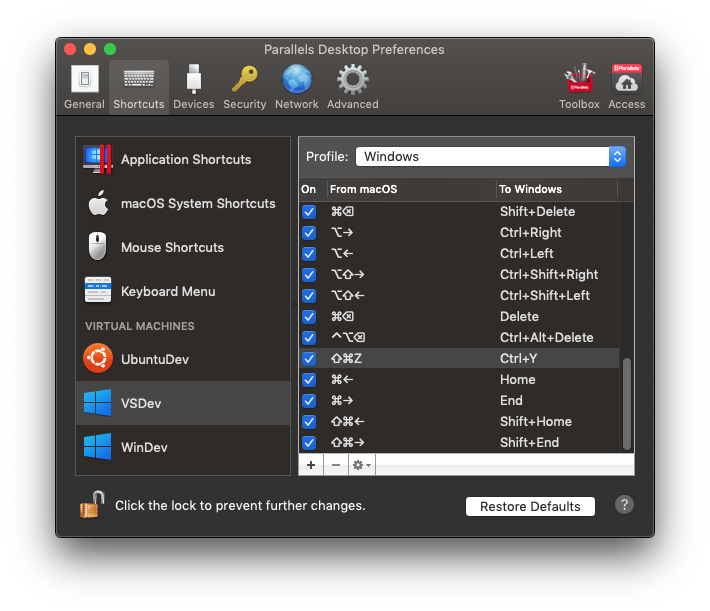

Eu descobri a utilidade de manter uma documentação dos passos que eu sigo sempre que eu configuro um novo computador para trabalho. Como tenho pelo menos duas estações de trabalho (a principal e a reserva), e de tempos em tempos me da a louca de formata-los quando acho que o sistema ficou muito bagunçado, a criação de um roteiro com tudo que eu preciso para deixar a máquina pronta para qualquer situação acelera muito as coisas, já que fazendo tudo de cabeça sempre sentia falta de alguma coisa no dia-a-dia.

Eu considero a preparação do ambiente como a manutenção da caixa de ferramentas. Um cozinheiro é sempre eficiente quando suas ferramentas de trabalho estão sempre afiadas e ao seu fácil alcance. O trabalho como desenvolvedor só se torna realmente produtivo quando estabelecemos um ambiente otimizado para nossas atividades diárias.

De tempos em tempos gosto de revisar esse roteiro, tanto para acrescentar descobertas como para rever ferramentas que talvez tenha esquecido. São tantos os recursos a nosso dispor que não é raro esquecermos que já temos facilitadores de uma tarefa.

## Preparação do Ambiente macOS
A preparação do ambiente macOS segue os passos abaixo:

### Formatar o computador e Instalar o Sistema Operacional
Para formatar o computador é necessário criar um disco de instalação. Primeiro é preciso baixar o macOS na App Store, depois inserir um pen-drive com pelo menos 8GB de espaço (que será limpado nesse processo). Basta executar o comando abaixo:

```bash
sudo /Applications/Install\ macOS\ Mojave.app/Contents/Resources/createinstallmedia --volume /Volumes/MyVolume
```

**Referência**: [How to create a bootable installer for macOS](https://support.apple.com/en-us/HT201372)

### Configurar a Rede para usar o DNS do Cloudfare
Seguindo os passos [deste link](https://developers.cloudflare.com/1.1.1.1/setting-up-1.1.1.1/mac/) configurar a rede para usar o DNS do Cloudflare. Não é apenas uma questão de segurança, mas em algumas redes tive problemas de acesso usando o DNS padrão por estarem bem mal configurados.

Em resumo é incluir os seguintes endereços nos adaptadores de rede:

```
1.1.1.1
1.0.0.1
2606:4700:4700::1111
2606:4700:4700::1001
```

Isso deve ser feito para cada uma das interfaces de rede do computador (Wi-fi, ethernet, etc.).

### Configurações e Extensões do Safari
No Safari há algumas coisas importantes para meu fluxo de trabalho:

* Na aba _General_: 
    * Marcar a opção **Safari opens with: All windows from last session**
* Na aba _Tabs_:
    * Marcar a opção **Show website icons in tabs** (muito útil para uma identificação visual das abas)
* Na aba _Advanced_ (Avançado):
    * Marcar a opção **Show full website address**
    * Marcar a opção **Show developer menu in menu bar** - isso também habilita a opção `Inspect` no menu do botão direito

Eu também uso as seguintes extensões (inclui os links pois elas ainda não foram migradas para a App Store):
* [Evernote Web Clipper](https://safari-extensions.apple.com/details/?id=com.evernote.safari.clipper-Q79WDW8YH9): Evernote is my knowledge bag and I use the clipper to save pages and links of important references.
* [Save to Pocket](https://safari-extensions.apple.com/details/?id=com.ideashower.pocket.safari-ET279A6R5N): I try to reduce the number of open tabs by saving most of them to Pocket.

### Configurações do Finder
O Finder por padrão é horrível. Faço algumas configurações que considero fundamentais:

* Na aba _General_:
    * New Finder windows show: _minha pasta home_
* Na aba _Sidebar_, deixo marcados apenas os seguintes favoritos:
    * Minha pasta Home
    * Downloads
    * Applications
* Na aba _Advanced_, incluo os itens:
    * Marcar a opção **Remove itens from Trash after 30 days**
    * Marcar a opção **Keep folders on top: In windows when sorting by name**
    * When performing a search: **Search the Current Folder**, pois pra mim não faz sentido o Finder fazer uma busca geral, geralmente eu quero encontrar os itens da própria pasta

Além disso ajusto algumas opções de visualização no menu _View_:
* Show Path Bar
* Show Status Bar

### Instalar os aplicativos da App Store
Com o sistema operacional recém instalado a primeira coisa que faço é instalar os aplicativos da app store. Sempre começo pelo _Amphetamine_, para deixar o computador ativo durante o download e instalação dos componentes que as vezes é demorado. Na sequência baixo o _Xcode_, esse mamute da Apple com seus mais de 6.5GB de download e um tempo incompreensível de instalação. Os demais podem vir sem ordem específica.

* [**Amphetamine**](https://itunes.apple.com/br/app/amphetamine/id937984704?l=en&mt=12)
* [**Xcode**](https://itunes.apple.com/br/app/xcode/id497799835?l=en&mt=12)
* Microsoft Office ([**Word**](https://itunes.apple.com/br/app/microsoft-word/id462054704?l=en&mt=12), [**Excel**](https://itunes.apple.com/br/app/microsoft-excel/id462058435?l=en&mt=12), [**PowerPoint**](https://itunes.apple.com/br/app/microsoft-powerpoint/id462062816?l=en&mt=12), [**Outlook**](https://itunes.apple.com/br/app/microsoft-outlook/id985367838?l=en&mt=12), [**OneNote**](https://itunes.apple.com/br/app/microsoft-onenote/id784801555?l=en&mt=12))
* [**OneDrive**](https://itunes.apple.com/br/app/onedrive/id823766827?l=en&mt=12)
* iWork Suite (Pages, Numbers, Keynote)
* [**Yoink**](https://itunes.apple.com/br/app/yoink-improved-drag-and-drop/id457622435?l=en&mt=12)
* Pocket
* Kindle
* [**PixelMator**](https://itunes.apple.com/br/app/flac-mp3-converter/id982124349?l=en&mt=12)
* TweetBot 3
* MacTracker
* DaisyDisk
* Asset Catalog Creator
* Display Menu
* Evernote
* Disconnect Premium
* Scrivener
* Telegram
* [**Cocoa JSON Editor**](https://itunes.apple.com/br/app/pages/id409201541?l=en&mt=12)
* Helium

### Instalar o SetApp
Sou um usuário antigo do [**Setapp**](https://setapp.com), desde que ele ainda estava em Beta e tinha menos da metade dos apps que tem hoje em seu catálogo. A plataforma é muito bem construída, muito prática e tem uma boa oferta de software (apesar de alguns importantes como o iMazing terem saido da plataforma recentemente). A versão mais recente da plataforma sincroniza a lista dos seus apps favoritos, facilitando a instalação de tudo que eu já uso logo que a plataforma é instalada.

>Eu removo o ícone do Setapp da barra de menu bem como o atalho de teclado padrão que ele sugere para buscar apps, já que considero atalhos inúteis.

Uma coisa que gosto do Setapp é que quando você faz login no site e vai no link de download, ele já baixa um instalador pre-configurado com seu login, então você não precisa se preocupar em fazer login novamente.

Os apps que uso do Setapp são:

* [**Bartender**](https://setapp.com/apps/bartender): Gerenciador dos ícones da barra de menu, bem completo e prático de usar. Gosto como ele inclui uma função que existe no tray do Windows a muito tempo, de esconder os ícones pouco usados.
* [**BetterZip**](https://setapp.com/apps/bartender): um ótimo gerenciador de arquivos compactados, acrescenta algumas funções úteis e suporte para outros padrões que o macOS não trata por padrão.
* [**ChatMate for WhatsApp**](https://setapp.com/apps/chatmate-for-whatsapp): Esse é um client de whats app para o desktop que não acrescenta lá funções muito úteis mas pelo menos tem o Dark Mode. Uso para minha conta pessoal do Zap.
* [**CleanMyMac X**](https://setapp.com/apps/cleanmymac-x): Esse aplicativo é indispensável para manutenção do macOS e o único que eu confio.
* [**Expressions**](https://setapp.com/apps/expressions): Um utilitário para construção de Regular Expressions, uso de vez em quando.
* [**iStat Menu**](https://setapp.com/apps/istat-menus): gosto de acessar rapidamente o estado do sistema, entender se algum processo esta comendo muito processamento.
* [**SQLPro Studio**](https://setapp.com/apps/sqlpro-studio): Esse tem sido meu client para acessar os sistemas de bancos de dados Postgree e SQL Azure. Funciona muito bem tendo até uma implementação básica de autocomplete. Salva as conexões no iCloud o que deixa bastante prático.
* [**Timing**](https://setapp.com/apps/timing): Uma espécie de "tempo de tela" do iOS para o Mac. Mas tem umas funções interessantes para gerenciamento do tempo, especialmente os relatórios de atividades e produtividade. Obrigatório.

### Instalar os aplicativos de outras fontes
Lista dos outros softwares que baixo diretamente de seus fabricantes, que não estão disponíveis na loja ou no Setapp, ou que adquiri diretamente.

* [**1Password**](https://1password.com/downloads/mac/): meu gerenciador de senhas, a primeira ferramenta que instalo.
* [**Alfred**](https://www.alfredapp.com): esse é o que o Spotlight deveria ser, e substitui ele devidamente.
* [**Dropbox**](https://www.dropbox.com/downloading): Apenas para manter as configurações do Alfredo sincronizadas. As vezes também uso par acompartilhar alguma coisa ou acessar aquivos de algum projeto.
* [**Visual Studio for Mac**](https://visualstudio.microsoft.com/downloads/): minha principal ferramenta de desenvolvimento.
* [**Visual Studio Code**](https://code.visualstudio.com/download): fora dos projetos específicos para o Visual Studio, o Code é meu editor padrão para arquivos texto.
* [**GitKraken**](https://www.gitkraken.com/download): meu cliente Git favorito. Acabo centralizando todos os meus projetos na ferramenta depois que adquiri a versão pro.
* [**Azure Data Studio**](https://docs.microsoft.com/en-us/sql/azure-data-studio/download): cliente multiplataforma de SQL Server da Microsoft. Acabo usando mais o SQLPro Studio, mas deixo essa ferramenta como um backup.
* [**Azure Storage Explorer**](https://azure.microsoft.com/en-us/features/storage-explorer/): cliente multiplataforma do Azure Storage. Utilizo em alguns projetos.
* [**Postman**](https://www.getpostman.com/downloads/): costumava ser minha principal ferramenta para manipular API's. Hoje esta um pouco de lado, já que outros recursos como Swagger tornou essa interação mais fácil. Mas ainda tenho alguns projetos na nuvem deles.
* [**Gorilla Player**](https://github.com/UXDivers/Gorilla-Player-Support/releases/download/v1.5.0.0/Gorilla.Player-1.5.0.dmg): Ferramenta para preview de telas XAML em projetos do Xamarin.Forms. Como ele é um pouco chato de configurar e por pra rodar, as vezes até acabo esquecendo de usar.
* [**Charles**](https://www.charlesproxy.com/download/): Ferramenta de Debug de HTTP multiplataforma. Indispensável para desenvolvimento web e mobile.
* [**Reflection 3**](https://www.airsquirrels.com/reflector/try): Geralmente uso esse utilitário para espelhar a tela do celular no meu computador durante uma aula ou demonstração de algum app.
* [**Parallels Desktop**](https://www.parallels.com/products/desktop/download/): uso para virtualizar o Windows (desenvolver com Visual Studio ou fazer alguma coisa específica de Windows) e o Linux (desenvolver para Android). Hoje é a melhor ferramenta de virtualização para Mac, mas esta ficando muito cara.
* [**Docker**](https://hub.docker.com/editions/community/docker-ce-desktop-mac): uso o community edition para baixar imagens do SQL Server ou Postgree para desenvolvimento. Estou com livros para estudar mais.
* [**Skype**](https://www.skype.com/en/get-skype/): a Microsoft estragou o Skype, é fato, mas os clientes ainda usam para comunicação.
* [**Spectacle**](https://www.spectacleapp.com): utilitário para incluir atalhos para gerenciamento das janelas.
* [**Itsycal**](https://www.mowglii.com/itsycal/): Esse utilitário me é indispensável. Sempre sinto falta de ter um calendário por perto. Além de mostrar a data atual da barra do menu ele da acesso fácil a um calendário para consulta.
* [**Screenflow**](http://www.telestream.net/controls/screenflow/download-screenflow.htm): Excelente programa para gravação da tela. Uso para montar algumas demonstrações dos meus trabalhos. Não há um link direto para download, tem que mandar o link para baixar o trial por e-mail.
* [**iMazing**](https://imazing.com/download/macos): O melhor gerenciador de dispositivos iOS. Meu principal uso dele é gerenciar os backups locais do meu iPhone, já que o gerenciamento de backups nativo do iOS/iTunes é bem espartano.
* [**Homebrew**](https://brew.sh): Gerenciador de pacotes para macOS que facilita a instalação de aplicativos e utilitários. Sempre útil ter a mão.
* [**Homebrew Cask**](https://github.com/Homebrew/homebrew-cask): extensão do Homebrew.
* [**Node.js**](https://nodejs.org/en/): Mais pelo npm que usamos para baixar algumas ferramentas, mas também estou começando a experimentar com ele.
* [**.NET Core SDK**](https://dotnet.microsoft.com/download): Por algum motivo esquisito, a versão mais recente do Visual Studio não instala o SDK mais recente do .NET Core por padrão, dai a necessidade de instalar a parte.
* [**Python**](https://www.python.org/downloads/): as vezes faço algumas brincadeirinhas e scripts com Python, nada profissional.
* [**Firefox**](https://www.mozilla.org/en-US/firefox/new/): Sou usuário do Safari, acho o melhor browser disponível para macOS, e também gosto da maneira como se integra ao iOS. De qualquer forma preciso ter o Firefox disponível caso precise testar algo que estou desenvolvendo, ou até para acessar contas de serviços separadas. Depois do Safari o Firefox hoje é sem dúvida o melhor browser disponível.
* [**Google Chrome**](https://www.google.com/chrome/): mantenho o Chrome instalado pelos mesmos motivos do Firefox. No meu ranking pessoal de melhores browsers ele fica em 3º lugar. Tanto por ser mais pesado que os outros como por estar na tutela do Google, que ainda não me inspira lá muita confiança.
* [**Musixmatch**](http://about.musixmatch.com/desktop-app): porque é gostoso cantar! Esse client Desktop funciona muito bem com o iTunes/Apple Music, apesar de estar em Beta.
* [**WhatsApp Web**](https://www.whatsapp.com/download/): Eu uso o cliente web para acessar minha conta Business, já que o no ChatMate só consigo manter uma conta por vez aberta.

### Instalar os plugins do QuickLook
O Quicklook é uma das funções mais úteis do macOS. Selecionando um arquivo no Finder basta apertar a barra de espaço e ele abrirá um modal mostrando um "Preview" desse arquivo. O problema é que poucos arquivos tem um visualizador por padrão, então há uma [série de plugins para o Quicklook nesse site](https://github.com/sindresorhus/quick-look-plugins) que deixam a ferramenta realmente completa. O melhor de tudo é que eles são bem simples de instalar usando o Homebrew Cask.

A lista nesse site é mais extensa, a seguir o script que uso para instalar só o que me interessa:

```bash
brew cask install qlcolorcode qlstephen qlmarkdown quicklook-json qlimagesize suspicious-package provisionql quicklookapk
```

### Instalar e configurar as fontes
Com o tempo fui coletando algumas fontes que uso no sistema ou para construção de alguns documentos e apresentações. Elas ajudam a tornar o conteúdo mais legível ou menos cansativo de ler (como a _Input_ por exemplo, desenhada para ser usada em editores de textos das IDE's e telas de terminal). Abaixo a lista de fontes que sempre instalo em meu sistema:

* [**Input**](http://input.fontbureau.com): excelente para IDE's como o Visual Studio e o Xcode.
* [**San Francisco**](https://developer.apple.com/fonts/): as fontes que a Apple criou para substituir a Helvetica nas novas versões do macOS e iOS. Ironicamente não aparecem por padrão na lista de fontes do sistema e precisam ser instaladas em separado.
* [**Josefins Sans**](https://www.fontsquirrel.com/fonts/josefin-sans): uso essa fonte em algumas apresentações e documentos.
* [**Montserrat**](https://fonts.google.com/specimen/Montserrat): uso essa fonte em algumas apresentações e documentos.
* [**Open Sans**](https://fonts.google.com/specimen/Open+Sans): uso essa fonte em algumas apresentações e documentos.
* [**Roboto**](https://fonts.google.com/specimen/Roboto): 
essa é a fonte padrão no sistema Android. As vezes preciso referenciá-lo nos projetos de alguns apps, motivo pelo qual preciso delas instaladas.

### Preparando o ambiente de desenvolvimento do Visual Studio

#### Visual Studio for Mac
No meu repositório [`dev-toolbox`](https://github.com/ravero/dev-toolbox) eu mantenho um script para sincronizar os Snippets e algumas configurações do Visual Studio para Mac na pasta `vs-utils`.

Além disso gosto de fazer as seguintes configurações (que ainda não encontrei uma forma automatizada de salvar):

* Tema escuro
* Fontes:
    * Editor de textos: Input Mono Regular, 14pt
    * General Pad Text: SF Pro Display, 14pt
    * Output Pad Constants: Input Mono Regular, 13pt
* Intellisense: 
    * Show import items
* Source Analysis
    * Enable text editor unit test integration (habilita a integração de funções de testes unitários no editor de código, como por exemplo executar o teste direto a partir do editor)

E por fim instalo os seguintes plug-ins:

* MFractor
* MSBuild Editor
* Open With
* Nuget Package Management Extensions


#### Visual Studio Code
Usar a extensão [Settings Sync](https://marketplace.visualstudio.com/items?itemName=Shan.code-settings-sync
) para sincronizar as configurações e extensões do Visual Studio Code.

ID do Gist das minhas configurações: `1a0f3224c1d0379597b8acfd54db4a5b`

#### Utilitário nuget.exe
O utilitário `nuget.exe` é usado para criar pacotes do Nuget e enviar para o feed público. A instalação no macOS depende do Mono (instalado junto com o Visual Studio for Mac).

```bash
# Download the latest stable `nuget.exe` to `/usr/local/bin`
sudo curl -o /usr/local/bin/nuget.exe https://dist.nuget.org/win-x86-commandline/latest/nuget.exe
```

Isso instala o utilitário na `/usr/local/bin`. Para executá-lo facilmente inclua uma referência no `.bash_profile`:

```bash
# Create as alias for nuget
alias nuget="mono /usr/local/bin/nuget.exe"
```

### Configurar o ambiente do Bash/Terminal
No meu repositório [`dev-toolbox`](https://github.com/ravero/dev-toolbox) eu mantenho uma cópia do arquivo `.bash_profile` que uso para carregar as configurações padrões das minhas janelas de terminal. Basicamente coloco no PATH o caminho das ferramentas do Android.

### Configurar os papéis de parede
Mantenho uma pasta com meus papéis de parede prediletos para rolar em meu desktop. Parece uma preocupação boba, mas é bom olhar imagens diferentes na tela que ficamos fitando o dia todo.

### Configurar a Touch Bar
Desde que a primeira versão do MacBook Pro Touchbar eu migrei para esse tipo de Mac. Passada a empolgação inicial você percebe que esse é um recurso completamente dispensável, tanto que quando estou usando um computador que não tem isso não sinto a menor falta.

Mas já que o recurso esta ai, vamos tentar tirar o melhor proveito dele. Felizmente ele suporta algumas customizações interessantes, em especial nos botões de atalho que ficam fixos na parte direita.

Essa configuração é feita em _System Preferences_ > _Keyboard_ > _Customize Touchbar_. Há dois tipos de atalhos globais, os que ficam sempre visiveis e os que aparecem ao clicar na setinha ao lado desses.

Esses são os atalhos padrões que uso:


E esses são os atalhos expandidos:


O Touchbar tem muitas opções interessantes, mas eu procuro colocar aquelas que não são diretamente acessíveis por um atalho de teclado, como a função _Sleep_ ou os atalhos para o _AirPlay_.

### Criar link simbólico para pasta do iCloud Drive
Quando você usa o iCloud Drive, as pastas locais ficam em um caminho escondido na `Library` do seu usuário. O Finder tem uma série de atalhos para acessar facilmente essas pastas, mas as vezes você quer acessá-la através do Terminal ou até montar scripts com os arquivos dela.

Para isso gosto de criar um link simbólico escondido na minha pasta Home:

```bash
ln -s ~/Library/Mobile\ Documents/com~apple~CloudDocs/ .icloud
```

Esse comando cria uma pasta escondida `.icloud`, dai você pode manipular ela no Terminal como se fosse uma pasta comum.

### Criar os atalhos de teclado para VM's do Parallels
Depois que você se torna um usuário de Mac, se acostuma com o seu teclado e com seus atalhos, fica dificil operar o Windows. O Parallels já tem pré-mapeados alguns dos atalhos mais comuns, mas acrescento mais alguns que eu considero fundamentais para conseguir usar o Windows, especialmente para edição de textos.



| Atalho        | macOS     | Windows
|---------------|-----------|---------------
| Mover o cursor para o início da linha | ⌘ + ← | Home
| Mover o cursor para o final da linha  | ⌘ + → | End
| Selecionar o texto até o começo da linha  | ⌘ + ⇧ + ← | Shift + Home
| Selecionar o texto até o final da linha   | ⌘ + ⇧ + → | Shift + End
| Refazer       | ⌘ + ⇧ + z | Ctrl + Y

Infelizmente o Parallels ainda não fornece um mecanismo para exportar esses atalhos, e também não encontrei os arquivos de configuração de onde poderia copiá-los, então é necessário configurar isso manualmente.